# Blazor_Study

## 목차   
1. [Blazor란](#blazor란)
2. [시작하기](#시작하기)
3. [클라이언트 구성](#클라이언트-구성)
4. [페이지 구성](#페이지-구성)
5. [컴포넌트 사용 예시](#컴포넌트-사용-예시)
6. [라이브러리 활용](#라이브러리-활용)
7. [구성 요소 수명주기에 따른 함수 활용](#구성-요소-수명주기에-따른-함수-활용)
8. [상태 유지](#상태-유지)
9. [컴포넌트 소개 및 활용](#컴포넌트-소개-및-활용)
10. [예시 페이지 상세설명](#예시-페이지-상세설명)
---

## Blazor란

Microsoft의 오픈소스 웹 개발 프레임워크이다.    
일반적으로 웹 개발시 사용되는 JavaScript 대신 .Net Core와 WebAssembly를 기반으로 C#을 사용하여 웹 UI를 빌드할 수 있다.

Blazor Server와 Blazor Webassembly 모델로 구분할 수 있으며, 각각의 특징은 다음과 같다.    
* Blazor Server    
    * 서버측에서 대부분의 렌더링과 프로세싱이 이루어짐
    * 클라이언트와는 SignalR을 사용하여 통신
    * 오프라인 모드가 존재하지 않음
* Blazor Webassembly 
    * 클라이언트에서 대부분의 렌더링 및 로직이 이루어짐
    * 어플리케이션 실행시 브라우저에 모든 파일을 다운받아 정적으로 사용

<br>

---

## 시작하기

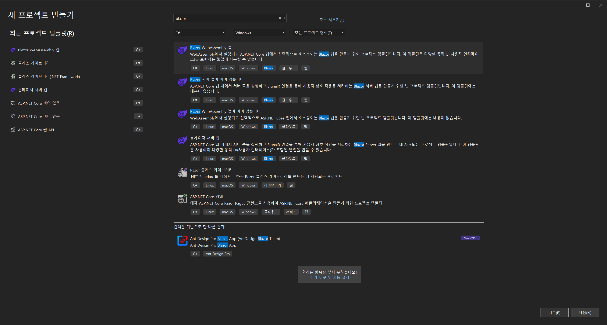
Visual Studio 2022 기준 Blazor 서버 앱 또는 Blazor WebAssembly 앱 템플릿을 선택할 수 있다.    
본 문서에서는 Blazor WebAssembly를 기준으로 설명한다.    

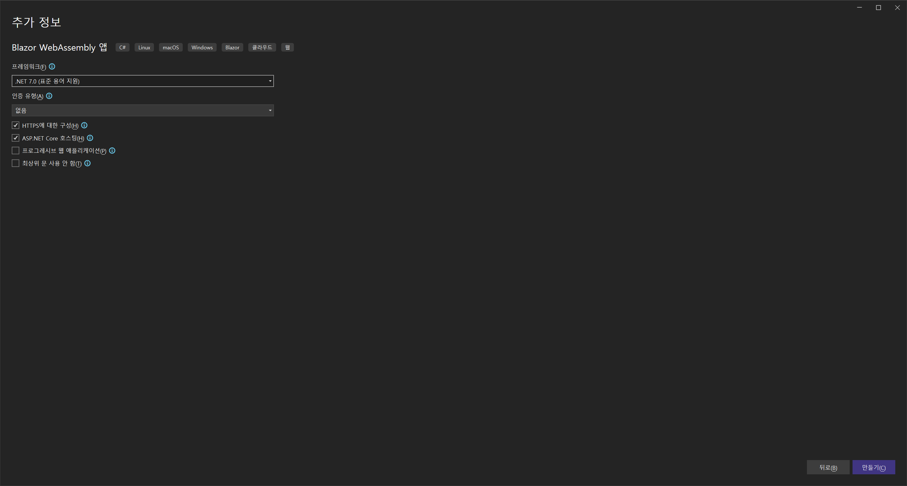

Blazor WebAssembly(WASM) 앱의 자산은 정적 파일로 배포되는데, 이 때 ASP.NET Core 호스팅 옵션으로 해당 파일을 제공하는 백엔드 앱의 사용 여부를 선택할 수 있다.    

[참고 : Blazor Server와 hosted Blazor WASM의 차이점](https://stackoverflow.com/questions/71265374/blazor-server-side-vs-blazor-webassembly-hosted)

본 문서에서는 호스팅된 Blazor WASM 모델을 기준으로 설명한다.


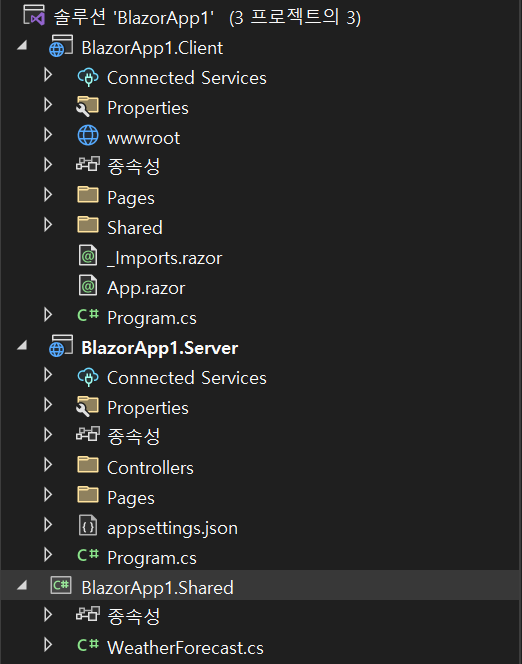

솔루션 생성시의 프로젝트 구성은 위 그림과 같다.    
- Client : 만들고자하는 실질적인 웹 어플리케이션
- Server : 해당 어플리케이션이 사용하는 API 컨트롤러를 호스팅
- Shared : Client와 Server 간에 공유되는 코드와 리소스 포함(DTO 등)    

완성된 앱은 Server 프로젝트에서 게시를 통해 배포할 수 있다.

<br>

---

## 클라이언트 구성


#### Pages 폴더

웹 어플리케이션에 라우팅되는 페이지들이 담겨져있는 폴더이다.    
**.razor** 확장자를 가진 파일이 각각의 페이지가 된다.

#### wwwroot 폴더
앱의 공용 정적 자산인 css파일 등을 포함하는 폴더이다.    
추후 외부 라이브러리를 활용할시 폴더 내의 index.html 파일에 css와 js 파일을 링크하여 사용한다.

#### Shared 폴더
공유 구성 요소 및 스타일시트를 포함하는 폴더이다.    
MainLayout.razor 파일에 앱의 레이아웃 구성 요소가 작성되어있으며, NavMenu.razor 파일에 사이드바 탐색이 구현되어있다.    
SurveyPrompt.razor 파일은 Blazor 설문 조사 구성 요소이므로 삭제해도 무방하다.    

#### _Imports.razor 파일
앱의 구성 요소에 포함할 네임스페이스의 @using 지시문을 모아두는 파일이다.

#### App.razor 파일
클라이언트의 라우팅을 설정하는 구성 요소 파일이다.    
\<NotFound> 항목으로 잘못된 라우팅에 대한 처리가 되어있음을 확인할 수 있다.    

#### Program.cs 파일
앱의 진입점으로 호스트 설정, 서비스 등록등의 작업이 이루어지는 파일이다.

<br>

---

## 페이지 구성
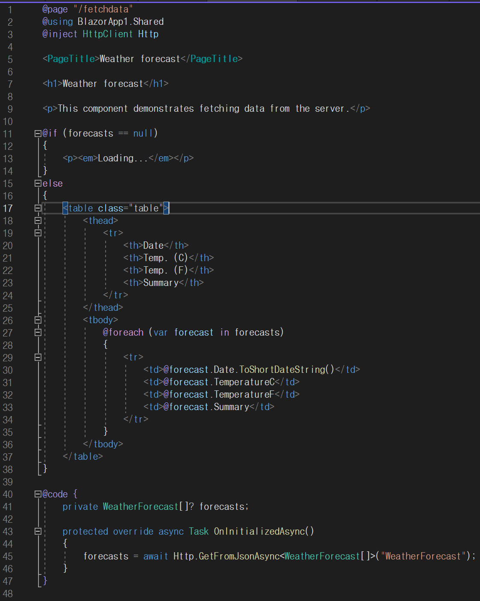

@page : 해당 페이지가 라우팅되는 url 작성       
@using : 참조할 namespace 지정    
@inject : 사용할 서비스 주입     

이후 html 태그 형태로 컴포넌트들을 호출한다.    
위 그림과 같이 if 등의 구문을 @if 형태로 사용하는 것도 가능하다.    
로직에 사용할 C# 코드는 @code {} 에 구현한다. 이곳에 정의해놓은 변수와 함수들은 html 태그 내에서 바인드하여 사용할 수 있다.    

페이지는 아래와 같이 다양한 방식으로 라우팅할 수 있다.
* `@page “/루트이름”`
* `@page “/{파라미터 전달 값}`
* `@page “/{숫자 전달:int}`
* `@page “/루트이름/{카테고리}/{숫자:int}`


<br/>

---

## 컴포넌트 사용 예시

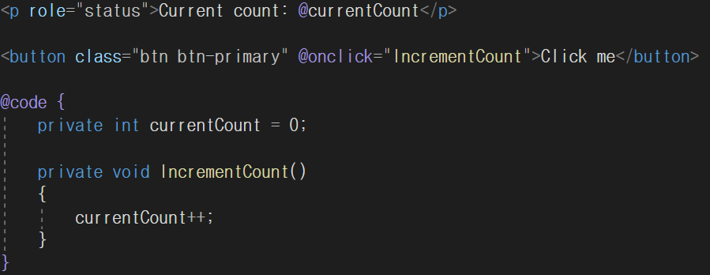

솔루션 생성시 기본적으로 작성되어있는 Counter.razor의 일부이다.    
문단을 생성하는 \<p>  컴포넌트에 변수 currentCount를 출력하도록 설정되어있다.   
그 아래의 \<button> 컴포넌트으로 버튼을 생성하고, @onclick 속성을 사용하여 클릭시 IncrementCount() 함수가 실행된다.    
단, 이 때 호출할 함수에 매개변수가 존재하는 경우에는 @(e => function(variable)) 과 같은 형태의 람다식을 사용한다.

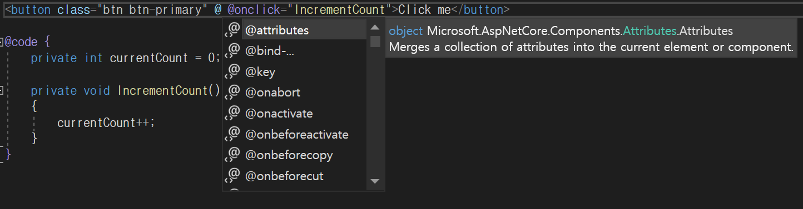
위와 같이 컴포넌트 내에서 사용할 수 있는 속성들은 @ 기호를 통해 설정할 수 있다.    

<br>

---

## 라이브러리 활용

솔루션 생성시 css 폴더 내부에 bootstrap 폴더가 존재하는 것을 볼 수 있는데, 이는 오픈소스 라이브러리로 다양한 컴포넌트들을 반응형으로 지원한다.    
그밖에도 Radzen, Ant Design 등의 다양한 라이브러리가 존재하므로 이를 활용하여 다양한 컴포넌트들을 사용할 수 있다.    

[Bootstrap 라이브러리](https://getbootstrap.com/docs/5.3/getting-started/introduction/)    
[Radzen 라이브러리](https://blazor.radzen.com/get-started)    
[Ant Design 라이브러리](https://antblazor.com/en-US/components/overview)    

<br>

---

## 구성 요소 수명주기에 따른 함수 활용


* Setparameter()
* OnInitialized()
* Onparameterset()
* Onafterrender()

각 함수들이 구성 요소의 수명주기 중 언제 실행되는지에 따른 활용이 가능하다.    
예를들어 DB에서 특정 목록을 불러와 그중 하나를 선택할 수 있는 Select 컴포넌트를 만들 경우, 컴포넌트가 렌더링 되기 전에 OnInitialized() 함수에서 DB에서 데이터를 가져온 후 이를 목록으로 사용할 수 있다.    

구성 요소의 상태가 변경되어있음을 알리는 StateHasChanged() 함수도 존재하는데, 함수 호출시 렌더링이 트리거된다.    
StateHasChanged() 함수는 EventCallback 메서드에 대해 자동으로 호출되며, 컴포넌트의 속성중 `@onclick`과 같은 `@on{}` 구문 사용시 이벤트 콜백이 발생하므로 해당 컴포넌트가 다시 렌더링되게된다.

[참고 : 컴포넌트의 수명주기](https://learn.microsoft.com/en-us/aspnet/core/blazor/components/lifecycle?view=aspnetcore-7.0)    


<br>

---

## 상태 유지

상태를 유지하기 위해서는 Blazored.LocalStorage 또는 BLazored.SessionStorage 패키지가 필요하다.    
* LocalStorage : 브라우저를 닫았다 열거나 하는 경우에도 명시적으로 데이터를 지우지 않는 한 상태가 유지되며, 탭을 여러 개 여는 경우 탭 간의 상태가 공유됨    
* Sessionstorage : 브라우저에서 하나의 탭으로 범위가 한정되며, 탭 또는 브라우저 종료시 상태가 손실됨

우선 상태 유지를 원하는 페이지에 `@inject Blazored.SessionStorage.ISessionStorageService sessionStorage`와 같이 서비스를 주입한다.    
상태를 유지할 데이터는 키값을 통해 관리되며, 
* 데이터 저장 : `await sessionStorage.SetItemAsync<Int64>("key", data);`
* 데이터 로드 : `await sessionStorage.GetItemAsync<Int64>("key");` 

페이지에 재접속시 `OnInitialized()` 함수에서 `sessionStorage.SetItemAsync()` 함수로 저장되어있는 상태가 있는지 확인하는 방식으로 활용할 수 있다.    

<br>

---

## 컴포넌트 소개 및 활용

### Button

BootStrap의 Button 컴포넌트를 아래와 같이 사용할 수 있다.    
    


```html
<button class="btn btn-primary" @onclick="Function">ButtonText</button>

@code
{
    void Function()
    {
        ...
    }
}
```
class에는 사용할 버튼의 디자인을 지정할 수 있으며, 디자인의 종류는 아래의 링크에서 확인할 수 있다.   
`@onclick` 속성으로 버튼 클릭시에 이루어질 행동을 지정한 함수를 실행한다.    
`<button ...>`과 `</button>` 사이의 텍스트는 버튼에 표기할 글자이다.    

[참고 : Bootstrap의 Button 컴포넌트 문서](https://getbootstrap.com/docs/5.3/components/buttons/)    

---

### TextBox
 
Ant Design의 TextBox 컴포넌트를 아래와 같이 사용할 수 있다.    
단, Ant Design 라이브러리를 사용하기 위해서는 사전 작업이 필요하므로 아래의 링크를 참고하도록 한다.     

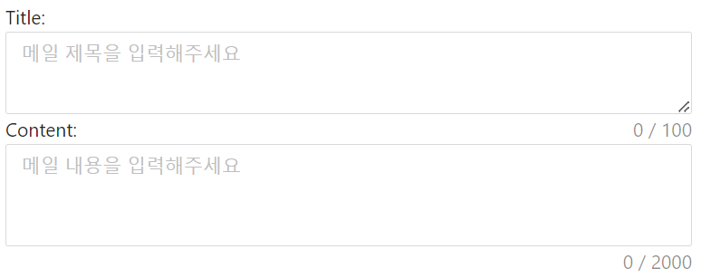

```html
Title:
    <TextArea ShowCount Placeholder="메일 제목을 입력해주세요" MaxLength=100 OnChange="onChange_title" AutoSize="false" />
Content:
    <TextArea ShowCount Placeholder="메일 내용을 입력해주세요" MaxLength=2000 OnChange="onChange_content" AutoSize="true" />

@code
{
    string title = string.Empty;

    void onChange_title(string value)
    {
        title = value;
    }
}
```
ShowCount, Placeholder, MaxLength 등의 옵션을 필요한대로 자유롭게 사용할 수 있다.    
OnChange 옵션으로 함수를 실행하여 입력받는 문자를 변수에 저장한다.    
입력받는 문자는 내부적으로 Value 패러미터가 string 형식으로 저장되며, OnChange 옵션으로 함수 호출시 해당 패러미터가 매개변수로 사용된다.    

[참고 : Ant Design 라이브러리 사전작업 설명 문서](https://antblazor.com/en-US/docs/getting-started)    
[참고 : Ant Design 라이브러리 Input 컴포넌트 문서](https://antblazor.com/en-US/components/input)    

---

### ComboBox

Ant Design의 ComboBox 컴포넌트를 아래와 같이 사용할 수 있다.    

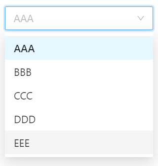

```html
<SimpleSelect DefaultValue="AAA" Style="width:200px;" OnSelectedItemChanged="handleChange">
    <SelectOptions>
        <SimpleSelectOption Value="AAA" Label="AAA"></SimpleSelectOption>
        <SimpleSelectOption Value="BBB" Label="BBB"></SimpleSelectOption>
        <SimpleSelectOption Value="CCC" Label="CCC"></SimpleSelectOption>
        <SimpleSelectOption Value="DDD" Label="DDD"></SimpleSelectOption>
        <SimpleSelectOption Value="EEE" Label="EEE"></SimpleSelectOption>
    </SelectOptions>
</SimpleSelect>

@code
{
    string category = string.Empty;

    void handleChange(string value)
    {
        category = value;
    }
}
```
TextBox와 마찬가지로 목록 중 선택한 값이 Value 패러미터에 저장되기 때문에 이를 활용할 수 있다.    

[참고 : Ant Design 라이브러리의 Select 컴포넌트 문서](https://antblazor.com/en-US/components/select)    

---

### 리스트박스

Radzen의 ListBox 컴포넌트를 아래와 같이 사용할 수 있다.
단, Radzen 라이브러리를 사용하기 위해서는 사전 작업이 필요하므로 아래의 링크를 참고하도록 한다. 

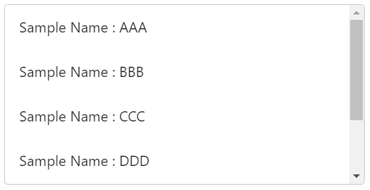

```html
<RadzenListBox @bind-Value=@selectedSampleID Data=@sampleList ValueProperty="SampleID" Style="width: 100%; max-width: 400px; height: 200px">
    <Template>
        Sample Name : @((context as Sample).Name)
    </Template>
</RadzenListBox>

@code
{
    public class Sample
    {
        public string Name { get; set; }
        public Int64 SampleID { get; set; }
    }

    Int64 selectedSampleID = 0;
    List<Sample> sampleList = new List<Sample>();
}
```

ValueProperty 옵션으로 저장할 항목을 지정하고, `@bind-Value`로 리스트에서 선택한 항목의 SampleID를 변수에 저장하도록 하였다.   
Radzen 라이브러리의 컴포넌트 역시 이 외에도 여러 옵션을 사용할 수 있다.    

[참고 : Radzen 라이브러리의 ListBox 컴포넌트 문서](https://blazor.radzen.com/listbox)
[참고 : Radzen 라이브러리 사전작업 설명 문서](https://blazor.radzen.com/get-started?theme=material)

---

### CheckBox

Ant Design의 CheckBox 컴포넌트를 아래와 같이 사용할 수 있다.    

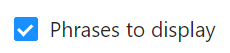

```html
<Checkbox @bind-Checked="isChecked">
    Phrases to display 
</Checkbox>

@code
{
    bool isCheckd = false;
}
```

위와 같이 체크 여부만을 체크해서 사용할 수도 있고, OnChange 옵션을 추가하여 체크시 곧바로 함수를 실행시킬 수도 있다.


[참고 : Ant Design 라이브러리의 CheckBox 컴포넌트 문서](https://antblazor.com/en-US/components/checkbox)      

---

### RadioBox

Ant Design의 RadioBox 컴포넌트를 아래와 같이 사용할 수 있다.    

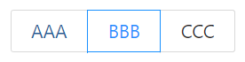

```html
<RadioGroup @bind-Value="@Type">
    <Radio RadioButton Value="@("AAA")">AAA</Radio>
    <Radio RadioButton Value="@("BBB")">BBB</Radio>
    <Radio RadioButton Value="@("CCC")">CCC</Radio>
</RadioGroup>

@code
{
    string Type = string.Empty;
}
```

RadioButton 옵션을 해제하면 일반적인 RadioBox의 디자인을 사용할 수 있다.         
위에서 봤던 컴포넌트들과 달리 Value 패러미터가 TValue 형식으로 저장되기 때문에 Value값 설정을 다르게 해주어야한다.    

[참고 : Ant Design 라이브러리의 Radio 컴포넌트 문서](https://antblazor.com/en-US/components/radio)   

---

### Tabs

Ant Design의 Tabs 컴포넌트를 아래와 같이 사용할 수 있다.  


```html
<Tabs @bind-ActiveKey="@activeKey" Animated>
    <TabPane Tab="Tab1" Key="1">
    </TabPane>
    <TabPane Tab="Tab2" Key="2">
    </TabPane>
    <TabPane Tab="Tab3" Key="3">
    </TabPane>
</Tabs>

@code
{
    string activeKey { get; set; } = "1";
}
```

몇번째 탭인지 지정할 키가 될 변수를 지정 후 사용한다.    

[참고 : Ant Design 라이브러리의 Tabs 컴포넌트 문서](https://antblazor.com/en-US/components/tabs)

---

### Message

Ant Design의 Message 컴포넌트를 아래와 같이 사용할 수 있다.  


```c#
@inject IMessageService _message

@code
{
    async Task SuccessMessage()
    {
        await _message.Success("Retrieve Item Success!");
    }
}
```

메시지로 띄우고자 하는 문자열 뒤에 double형 매개변수를 사용하여 메시지가 띄워져있는 시간을 설정할 수도 있다.

[참고 : Ant Design 라이브러리의 Message 컴포넌트 문서](https://antblazor.com/en-US/components/message)

--- 

### Modal

Ant Design의 Modal 컴포넌트를 아래와 같이 사용할 수 있다.


```html
<Button Type="primary" OnClick="@(()=>{ _visible = true; })">
    Button
</Button>

@{
    RenderFragment footer =
    @<Template>
        <Button Type="primary" OnClick="@(async ()=>{ await Confirm(); })" Loading="@_loading">Confirm</Button>
        <Button OnClick="@(()=>{ _visible = false; })">Cancel</Button>
    </Template>;
}

<Modal Title="!WARNING!"
       Visible="@_visible"
       Footer="@footer">
    <p>이 행동은 되돌릴 수 없습니다. 정말로 데이터를 삭제하시겠습니까?</p>
</Modal>

@code
{
    bool _visible = false;
    bool _loading = false;

    async Task Confirm()
    {
        _loading = true;
        await DeleteItem();
        _loading = false;
        _visible = false;
    }
}
```

Visible 변수로 Modal dialog를 띄울지 여부를 판단한다.    
Footer 옵션은 선택사항이며, 사용하지 않을경우 footer를 따로 작성하지 않고 Modal의 OnOk와 OnCancel 옵션을 사용할 수 있다.    
이 때는 OkText와 CancleText 옵션을 통해 각각 버튼에 표기될 텍스트를 설정할 수 있다.    

[참고 : Ant Design 라이브러리의 Modal 컴포넌트 문서](https://antblazor.com/en-US/components/modal)

<br>

---

## 예시 페이지 상세설명

### 페이지 공통

게임 서버와의 API 통신을 해야하는 경우 우선 각 페이지에서 필요한 서비스의 함수를 호출한다.    
이후 해당 서비스에서 웹 어플리케이션의 서버로 API를 호출하고, 호출된 웹 어플리케이션 서버의 컨트롤러에서 다시 게임 서버로 API를 호출하는 구조로 이루어져있다.        


### 특정 사용자 조회
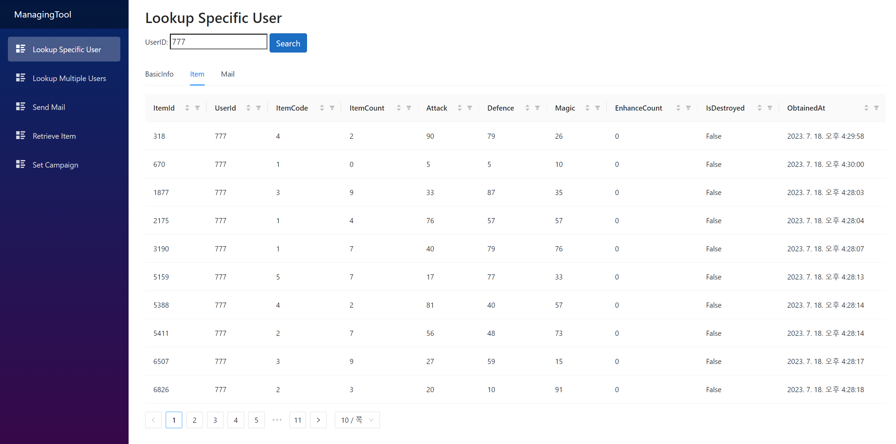

특정 사용자를 UserID로 검색하여 DB로부터 데이터를 읽어오는 페이지이다.

#### 사용된 주요 컴포넌트

- Input (Bootstrap)

    ```html
    UserID:
    <input type="number" @bind="userId" class="form-label" name="UserID">UserID</input>

    @code
    {
        Int64 userId = 0;
    }
    ```
    검색할 userId를 입력받는 컴포넌트이다. 

- Button (Bootstrap)

    ```html
    <button class="btn btn-primary" @onclick="GetUserData" >Search</button>

    @code
    {
        async Task GetUserData()
        {
            await GetUserBasicInfo();
            await GetUserItemList();
            await GetUserMail();

            await sessionStorage.SetItemAsync<Int64>("userid", userId);
        }
    }
    ```
    클릭시 GetUserData 함수를 호출하여 실질적인 로직이 진행되도록 하는 컴포넌트이다.    

- Tabs (Ant Design)

    ```html
    <Tabs @bind-ActiveKey="@activeKey" Animated>
        <TabPane Tab="BasicInfo" Key="1">
            ...
        </TabPane>
        <TabPane Tab="Item" Key="2">
            ...
        </TabPane>
        <TabPane Tab="Mail" Key="3">
            ...
        </TabPane>
    </Tabs>
    
    @code
    {
        string activeKey { get; set; } = "1";
    }
    ```
    BasicInfo, Item, Mail에 관한 데이터를 각각 탭으로 분리하여 표시되도록 하는 컴포넌트이다.    

- Table (Ant Design)

    ```html
    <Table TItem="UserInfo" DataSource="@userDataSet" RowClassName="@(_=>"editable-row")">
        <ChildContent Context="data">
                ...
        </ChildContent>
    </Table>
    <Table TItem="UserItem" DataSource="@userItemDataSet">
        <GenerateColumns Range="0.." Definitions=definitions />
    </Table>
    <Table TItem="MailData" DataSource="@userMailDataSet">
        <GenerateColumns Range="0.." Definitions=definitions />
    </Table>

    @code
    {
        List<UserInfo> userDataSet = new();
        List<UserItem> userItemDataSet = new();
        List<MailData> userMailDataSet = new();

        void definitions(string propertyName, object column)
        {
            column.SetValue("Sortable", true);
            column.SetValue("Filterable", true);
        }
    }
    ```
    UserInfo에 사용된 테이블과 UserItem, MailData에 사용된 테이블의 생성 방식이 다르게 구성되어있다.
    - UserItem, MailData 테이블    
        DB에서 가져온 정보가 저장되어있는 데이터셋을 DataSource로 전달하고, 해당 자료형에 맞게 자동으로 Column을 생성하는 GenerateColumns 옵션을 사용하였다.    
        또한 Definitions 옵션으로 각 Column마다 정의될 Action을 설정하는 함수를 지정하였고, 해당 함수에서는 각 Column에 정렬과 필터 기능을 사용 가능하도록 설정하였다.
    - UserDataSet 테이블
        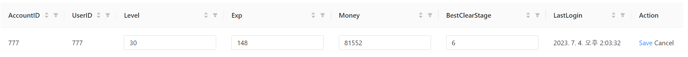
        ```html
        <ChildContent Context="data">
            <PropertyColumn Property="c=>c.AccountID" Sortable="true" Filterable="true" />
            <PropertyColumn Property="c=>c.UserID" Sortable="true" Filterable="true" />
            <PropertyColumn Property="c=>c.Level" Sortable="true" Filterable="true">
                @if (!editCache.ContainsKey(data.UserID) || !editCache[data.UserID].edit)
                {
                    @data.Level
                }
                else
                {
                    <Input @bind-Value="editCache[data.UserID].data.Level" />
                }
            </PropertyColumn>
            ...
            ...
            <ActionColumn Title="Action">
                @if (!editCache.ContainsKey(data.UserID) || !editCache[data.UserID].edit)
                {
                    <a @onclick="() => startEdit(data.UserID)" class="edit">Edit</a>
                }
                else
                {
                    <Popconfirm Title="Sure to Save?"
                        OnConfirm="() => saveEdit(data.UserID)"
                        OkText="Yes"
                        CancelText="No">
                        <a class="save">Save</a>
                    </Popconfirm>
                    <a @onclick="() => cancelEdit(data.UserID)">Cancel</a>
                }
            </ActionColumn>
        </ChildContent>
        ```

        ```c#
        @code
        {
            IDictionary<Int64, (bool edit, UserInfo data)> editCache = new Dictionary<Int64, (bool edit, UserInfo data)>();

            void startEdit(Int64 id)
            {
                editCache[id] = (true, editCache[id].data);
            }

            void cancelEdit(Int64 id)
            {
                var data = userDataSet.FirstOrDefault(item => item.UserID == id);
                editCache[id].data.Level = data.Level;
                editCache[id].data.Exp = data.Exp;
                editCache[id].data.Money = data.Money;
                editCache[id].data.BestClearStage = data.BestClearStage;
                editCache[id] = (false, editCache[id].data);
            }

            async void saveEdit(Int64 id)
            {
                var index = userDataSet.FindIndex(item => item.UserID == id);
                userDataSet[index].Level = editCache[id].data.Level;
                userDataSet[index].Exp = editCache[id].data.Exp;
                userDataSet[index].Money = editCache[id].data.Money;
                userDataSet[index].BestClearStage = editCache[id].data.BestClearStage;
                editCache[id] = (false, editCache[id].data);

                await UserDataService.UpdateUserBasicInfo(userDataSet[index]);
                await sessionStorage.SetItemAsync<List<UserInfo>>("userinfo", userDataSet);
            }
        }
        ```
        데이터 수정 기능을 구현하기 위해서는 수정하고자하는 특정 Column의 새로운 임시 입력값이 필요하며, 이를 저장하기 위해 Dictionary 변수인 editCache를 사용하였다.        
        
        Action Column에서 Edit을 누르면 startEdit() 함수가 실행되어 editCache의 bool값이 true가 되고, 이를 수정하는 Column이 인식하여 새롭게 Input을 띄운 후 수정값을 입력하면 editCache에 저장된다.    
        이 때 GenerateColumns 옵션을 사용하면 Column이 조건에 따라 Input을 받도록 하는 작업이 불가능했기 때문에 PropertyColumn 옵션으로 각각의 Column들을 따로 생성하여 데이터를 매치시켜주었다.

        이후 Cancel 버튼을 누를 경우 cancelEdit() 함수가 실행되어 userDataSet에 저장되어있는 원래 값으로 원복한다.    
        Save 버튼을 누를 경우에는 saveEdit() 함수가 실행되어 userDataSet의 데이터를 수정된 값으로 변경하고, UserDataService의 UpdateUserBasicInfo() 함수를 통해 DB를 갱신하는 작업을 진행한다.    

        작업이 끝난 후에는 공통적으로 editCache의 bool값을 false로 변경하여 수정 작업이 끝났음을 알린다.    

#### 추가 기술사항

추가로 본 페이지에는 상태 유지 기능이 구현되어있다.    
즉, 다른 페이지를 열었다 다시 돌아온 후에도 페이지에 로딩되어있는 데이터가 유지된다.     
이는 위 [상태 유지](#상태-유지) 항목에서 설명한 것처럼 Blazor의 SessionStorage 기능을 활용하여 다음과 같은 방식으로 작동되도록 하였다.    

1. 유저 데이터를 받아온 이후 각각의 데이터셋을 `sessionStorage.SetItemAsync<>()` 함수로 세션에 저장
2. 페이지를 새로 로딩시 `OnInitializedAsync()` 함수에서 `sessionStorage.GetItemAsync<>()` 함수로 불러온 데이터셋을 각 변수에 저장

<br>

---

### 다수 사용자 조회

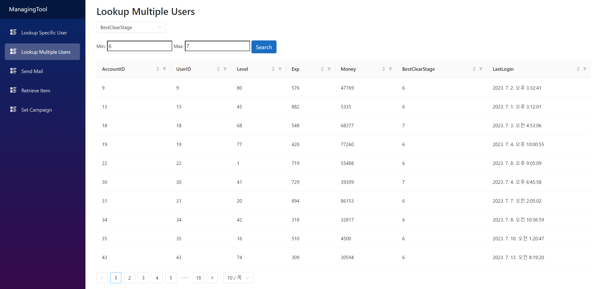

다수의 사용자를 지정한 속성의 범위값으로 검색하여 DB로부터 데이터를 읽어오는 페이지이다.

#### 사용된 주요 컴포넌트

- ComboBox (Ant Design)

    ```html
    <SimpleSelect DefaultValue="UserID" Style="width:200px;" OnSelectedItemChanged="handleChange">
        <SelectOptions>
            <SimpleSelectOption Value="UserID" Label="UserID"></SimpleSelectOption>
            <SimpleSelectOption Value="Level" Label="Level"></SimpleSelectOption>
            <SimpleSelectOption Value="Money" Label="Money"></SimpleSelectOption>
            <SimpleSelectOption Value="BestClearStage" Label="BestClearStage"></SimpleSelectOption>
            <SimpleSelectOption Value="LastLogin" Label="LastLogin"></SimpleSelectOption>
        </SelectOptions>
    </SimpleSelect>

    @code
    {
        string category = "UserID";

        void handleChange(string value)
        {
            category = value;
        }
    }
    ```
    검색할 속성값을 목록에서 선택하는 컴포넌트이다.

- Input (Bootstrap)

    ```html
    Min:
    <input type="number" @bind="minValue" class="form-label" name="Min">Min</input>
    Max:
    <input type="number" @bind="maxValue" class="form-label" name="Max">Max</input>

    @code
    {
        Int64 minValue = 0;
        Int64 maxValue = 0;
    }
    ```
    검색할 범위값을 입력받는 컴포넌트이다. 

- Button (Bootstrap)

    ```html
    <button class="btn btn-primary" @onclick="GetMultipleUserBasicInfo">Search</button>

    @code
    {
        async Task GetMultipleUserBasicInfo()
        {
            userDataSet.Clear();

            userDataSet = await UserDataService.GetMultipleUserBasicInfo(category, minValue, maxValue);
        }
    }
    ```
    클릭시 GetMultipleUserBasicInfo() 함수를 호출하여 실질적인 로직이 진행되도록 하는 컴포넌트이다.

- Table (Ant Design)

    ```html
    <Table TItem="UserInfo" DataSource="@userDataSet">
        <GenerateColumns Range="0.." Definitions=definitions />
    </Table>

    @code
    {
        List<UserInfo> userDataSet = new();

        void definitions(string propertyName, object column)
        {
            column.SetValue("Sortable", true);
            column.SetValue("Filterable", true);
        }
    }
    ```
    받아온 데이터들을 테이블로 표시하는 컴포넌트이다.

각 컴포넌트들의 구조 및 사용방법은 위 항목들에서 설명했던 것들과 동일하다.

<br/>

--- 

### 메일 전송


특정 사용자에게 아이템 첨부가 가능한 메일을 전송하는 페이지이다.    

#### 사용된 주요 컴포넌트

- Input (Bootstrap)

    ```html
    UserID:
    <input type="number" @bind="userId" @bind:event="oninput" class="form-label" name="UserID">UserID</input>

    ItemCount:
    <input type="number" @bind="itemCount" class="form-label" name="ItemCount">ItemCount</input>

    @code
    {
        Int64 userId = 0;
        Int64 itemCount = 0;
    }
    ```
    메일을 보낼 대상과 첨부할 아이템의 개수를 입력하는 컴포넌트이다.

- Button (Bootstrap)

    ```c#
    <button class="btn btn-primary" @onclick="SendMailByUserID">Send</button>

    @code
    {
        MailForm mailForm = new MailForm();

        private async Task SendMailByUserID()
        {
            mailForm.Title = title;
            mailForm.Content = content;
            mailForm.ItemCode = selectedItem.Code;
            mailForm.ItemCount = itemCount;

            if (userId == 0)
            {
                await _message.Error("Please Write UserID!");
                return;
            }

            if (mailForm.Title == string.Empty || mailForm.Content == string.Empty)
            {
                await _message.Error("Please Write Title and Content!");
                return;
            }

            var isSuccess = await MailService.SendMail(mailForm, userId);
            if (isSuccess.errorCode == ErrorCode.None)
            {
                await _message.Success("Send Mail Success!");
            }
        }
    }
    ```
    클릭시 SendMailByUserID() 함수를 호출하여 실질적인 로직이 진행되도록 하는 컴포넌트이다.

- TextBox (Ant Design)

    ```html
    Title:
    <TextArea ShowCount Placeholder="메일 제목을 입력해주세요" MaxLength=100 OnChange="onChange_title" AutoSize="false" />

    Content:
    <TextArea ShowCount Placeholder="메일 내용을 입력해주세요" MaxLength=2000 OnChange="onChange_content" AutoSize="true" />

    @code
    {
        void onChange_title(string value)
        {
            title = value;
        }

        void onChange_content(string value)
        {
            content = value;
        }
    }
    ```
    메일 제목과 본문을 텍스트로 입력받는 컴포넌트이다.    
    MaxLength 옵션으로 최대 길이를, AutoSize 옵션으로 입력창 크기를 자동으로 조절할 것인지를 설정하였다.    

- ComboBox (Ant Design)

    ```html
    <Select TItem="ItemAttribute"
        TItemValue="ItemAttribute"
        DataSource="@itemList"
        @bind-Value="@selectedItem"
        LabelName="@nameof(ItemAttribute.Name)"
        EnableSearch
        DefaultValue=null
        Placeholder="Select an Item"
        OnSelectedItemChanged="OnSelectedItemChangedHandler"
        SortByLabel="@SortDirection.Ascending"
        AllowClear
        Style="width: calc(100% - 68px);">
    </Select>

    @code
    {
        List<ItemAttribute> itemList = new List<ItemAttribute>();
        ItemAttribute selectedItem = new ItemAttribute();

        void OnSelectedItemChangedHandler(ItemAttribute value)
        {
            selectedItem = value;
        }
    }
    ```
    메일에 첨부할 아이템을 목록에서 선택하는 컴포넌트이다.    
    EnableSearch 옵션을 사용하여 검색이 가능하게 하였다.    


- DropDown (Ant Design)

    ```html
    <Dropdown Style="padding-left: 8px;" Trigger="@(new Trigger[] { Trigger.Click })">
        <Overlay>
            <Menu Selectable="false">
                <MenuItem OnClick="@SetWeaponList">Weapon LIst</MenuItem>
                <MenuItem OnClick="@SetArmorList">Armor List</MenuItem>
                <MenuItem OnClick="@SetClothesList">Clothes List</MenuItem>
                <MenuItem OnClick="@SetMagicToolList">MagicTool List</MenuItem>
                <MenuItem OnClick="@ClearDS">Clear</MenuItem>
            </Menu>
        </Overlay>
        <ChildContent>
            <a class="ant-dropdown-link" @onclick:preventDefault>Actions<Icon Type="down" /></a>
        </ChildContent>
    </Dropdown>

    @code
    {
        void SetWeaponList()
        {
            itemList = itemTable.itemWeapon;
        }
        
        ...
        ...

        private void ClearDS()
        {
            itemList = null;
            selectedItem = null;
        }
    }
    ```
    ComboBox에 표기할 목록을 선택하는 컴포넌트이다.    
    ComboBox의 목록은 DataSource로 지정한 itemList에서 가져오는데, 이 itemList를 변경하여 카테고리별로 목록이 표기되도록 한다.    

- Message (Ant Design)

    ```c#
    await _message.Error("Please Write UserID!");
    await _message.Error("Please Write Title and Content!");
    await _message.Success("Send Mail Success!");
    ```
    화면에 팝업 메시지를 띄우는 컴포넌트이다.

<br/>

--- 

### 아이템 회수

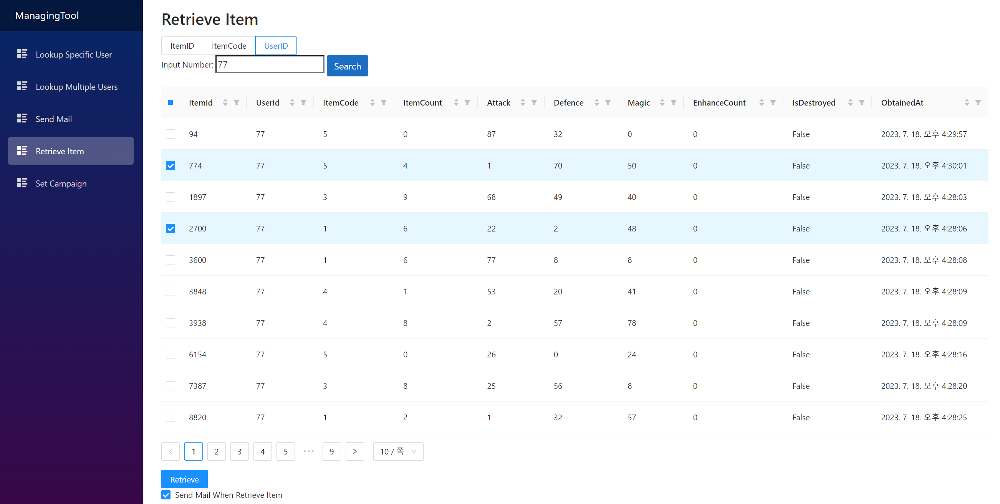

특정 아이템을 지정하여 DB에서 삭제하는 페이지이다.

#### 사용된 주요 컴포넌트

- RadioBox (Ant Design)

    ```html
    <RadioGroup @bind-Value="@searchType">
        <Radio RadioButton Value="@("ItemID")">ItemID</Radio>
        <Radio RadioButton Value="@("ItemCode")">ItemCode</Radio>
        <Radio RadioButton Value="@("UserID")">UserID</Radio>
    </RadioGroup>

    @code
    {
        string searchType = "ItemID";
    }
    ```
    회수할 아이템을 검색하기 위한 카테고리를 설정하는 컴포넌트이다.

- Input (Bootstrap)

    ```html
    Input Number:
    <input type="number" @bind="searchValue" class="form-label" name="SearchValue">Input Number</input>

    @code
    {
        Int64 searchValue = 0;
    }
    ```
    검색할 숫자를 입력하는 컴포넌트이다.

- Button (Bootstrap)

    ```html
    <button class="btn btn-primary" @onclick="GetUserItemList">Search</button>
    <Button Type="primary" OnClick="@(()=>{ if (selectedRows != null && selectedRows.Count() != 0) _visible = true; else ErrorMessage(); })">
    Retrieve
    </Button>

    @code
    {
        List<UserItem> UserItemDataSet = new();

        async Task GetUserItemList()
        {
            UserItemDataSet.Clear();

            var response = await ItemService.GetUserItemList(searchType, searchValue);
            UserItemDataSet = response.UserItem;
        }
    }
    ```
    클릭시 GetUserItemList() 함수를 호출하거나, _visible 값을 true로 변경하여 Modal Dialog가 나타나도록 하는 컴포넌트이다.    

- Table (Ant Design)

    ```html
    <Table TItem="UserItem" DataSource="@UserItemDataSet" @bind-SelectedRows="selectedRows">
    <Selection Key="@(context.ItemId.ToString())" Disabled="@(context.IsDestroyed == true)" />
    <GenerateColumns Range="0.." Definitions=definitions />
    </Table>

    @code
    {
        IEnumerable<UserItem> selectedRows;
    }
    ```
    받아온 데이터들을 테이블로 표시하는 컴포넌트이다.    
    타 페이지들에서 사용한 테이블들과는 달리 특정 row를 선택할 수 있도록 `@bind-SelectedRows` 옵션이 설정되어있다.    
    이 때 Disabled 옵션을 사용하여 특정 조건에 해당하는 row는 선택이 불가능하도록 만들 수 있다.    

- CheckBox (Ant Design)
    ```html
    <Checkbox @bind-Checked="sendMail">
       Send Mail When Retrieve Item
    </Checkbox>

    @code
    {
        bool sendMail = true;
    }
    ```
    아이템 회수시 메일 전송 여부를 선택하는 컴포넌트이다.

- Modal (Ant Design)

    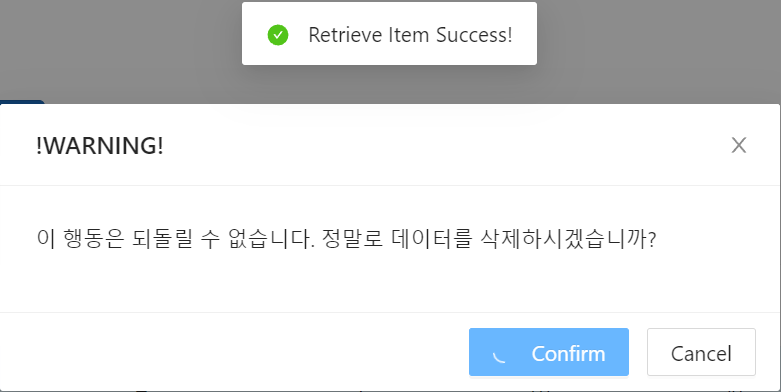

    ```html
    @{
    RenderFragment footer =
        @<Template>
            <Button OnClick="@(async ()=>{ await RetrieveButtonClick(); await SuccessMessage();})"
                    Type="primary" Loading="@_loading">
                Confirm
            </Button>
            <Button OnClick="@(()=>{ _visible = false; })">Cancel</Button>
        </Template>;
    }

    <Modal Title="!WARNING!"
        Visible="@_visible"
        Footer="@footer">
        <p>이 행동은 되돌릴 수 없습니다. 정말로 데이터를 삭제하시겠습니까?</p>
    </Modal>
    ```

    ```c#
    @code
    {
        async Task RetrieveButtonClick()
        {
            await RetrieveUserItem();
            _visible = false;
        }

        async Task RetrieveUserItem()
        {
            if (selectedRows.Count() != 0)
            {
                _loading = true;

                if (sendMail == true)
                {
                    var response = await ItemService.RetrieveUserItem(selectedRows, mailForm);
                }
                else
                {
                    var response = await ItemService.RetrieveUserItem(selectedRows, null);
                }

                await GetUserItemList();

                _loading = false;
            }
            else
            {
                await ErrorMessage();
            }
        }
    }
    ```
    아이템 회수 버튼 클릭시 창에 띄워지는 Modal Dialog 컴포넌트이다.    
    Footer 옵션으로 다이얼로그의 형식을 설정하였으며, Confirm 버튼 클릭시 RetrieveButtonClick() 함수가 호출되어 실질직인 로직이 진행된다.    
    Loading 옵션을 사용하여 로직이 진행되는 동안 작업이 진행중임을 표시하였다.    
    작업이 끝나면 GetUserItemList() 함수를 호출하여 테이블을 갱신하고, _loading과 _visible 변수를 false로 변경하여 모든 작업이 끝났음을 알린다.    

- Message (Ant Design)

    ```c#
    @code
    {
        async Task SuccessMessage()
        {
            await _message.Success("Retrieve Item Success!", 10);
        }

        async Task ErrorMessage()
        {
            await _message.Error("No Selected Item!");
        }
    }
    ```
    화면에 팝업 메시지를 띄우는 컴포넌트이다.

<br/>

--- 

### 캠페인 설정

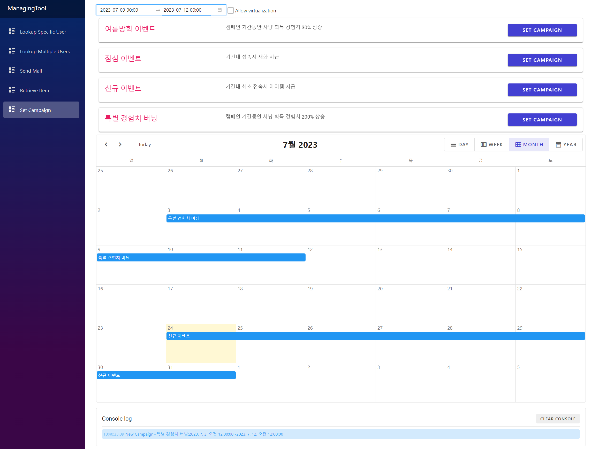

특정 캠페인과 기간을 지정하여 설정하는 페이지이다.    
단, 현재는 DB와 연동하는 기능은 구현되어있지 않으며 컴포넌트에 표기하기 위한 최소한의 기능만 구현되어있다.   

#### 사용된 주요 컴포넌트

- DatePicker (Ant Design)

    ```html
    <RangePicker TValue="DateTime?[]" ShowTime='@("HH:mm")' OnChange="OnRangeChange"/>

    @code
    {
        List<DateTime> period = new List<DateTime>();

        void OnRangeChange(DateRangeChangedEventArgs args)
        {
            period.Add(args.Dates[0].Value);
            period.Add(args.Dates[1].Value);
        }
    }
    ```
    기간을 설정하는 컴포넌트이다.

- CheckBox (Radzen)
    
    ```html
    <RadzenCheckBox @bind-Value="@allowVirtualization" Name="allowVirtualization" />
    <RadzenLabel Text="Allow virtualization" Component="allowVirtualization" />

    @code
    {
        bool allowVirtualization = false;
    }
    ```
    아래 DataList의 Virtualization을 허용할 것인지 여부를 선택하는 컴포넌트이다.    

- DataList (Radzen)

    ```html
    <RadzenDataList AllowVirtualization=@allowVirtualization Style="@(allowVirtualization ? "height:400px;overflow:auto;" : "")"
                    WrapItems="@(!allowVirtualization)" AllowPaging="@(!allowVirtualization)"
                    Data="@campaigns" TItem="Campaign" PageSize="5" PagerHorizontalAlign="HorizontalAlign.Left" ShowPagingSummary="true">
        <Template Context="campaign">
            <RadzenCard Style="width: 100%; padding: 0;">
                <RadzenRow Gap="0">

                    <RadzenColumn Size="12" SizeLG="3" Class="rz-p-4 product-title">
                        <RadzenText TextStyle="TextStyle.H6" TagName="TagName.H5" class="rz-color-secondary">@(campaign.Title)</RadzenText>
                    </RadzenColumn>

                    <RadzenColumn Size="12" SizeLG="7" Class="rz-p-4">
                        <RadzenRow Gap="0">
                                <RadzenText TextStyle="TextStyle.H6" TagName="TagName.H5" Class="rz-mb-0"></RadzenText>
                                <RadzenText TextStyle="TextStyle.Body2">@(campaign.Content)</RadzenText>
                        </RadzenRow>
                    </RadzenColumn>

                    <RadzenColumn Size="12" SizeLG="2" Class="rz-p-4">
                        <RadzenButton Text="Set Campaign" Style="width: 100%" Click=@(args => SetNewCampaign(campaign)) />
                    </RadzenColumn>

                </RadzenRow>
            </RadzenCard>
        </Template>
    </RadzenDataList>

    @code
    {
        RadzenScheduler<AppointmentData> scheduler;
        IList<AppointmentData> appointments = new List<AppointmentData>();

        async Task SetNewCampaign(Campaign campaign)
        {
            if (period == null || period.Count == 0)
            {
                await _message.Error("기간을 설정해주세요.");
                return;
            };

            AppointmentData data = new AppointmentData
            {
                Start = period[0],
                End = period[1],
                Text = campaign.Title
            };

            if (data != null)
            {
                appointments.Add(data);
                await scheduler.Reload();
            }

            console.Log($"New Campaign={data.Text}:{data.Start}~{data.End}");
            await _message.Success("Success!");
        }
    }
    ```
    캠페인 리스트를 담아두고, 버튼 클릭시 스케쥴러에 캠페인을 등록시키는 컴포넌트이다.    

- Scheduler (Radzen)

    ```html
    <RadzenScheduler @ref=@scheduler SlotRender=@OnSlotRender style="height: 768px;" 
                    TItem="AppointmentData" Data=@appointments StartProperty="Start" EndProperty="End"
                    TextProperty="Text" SelectedIndex="2" AppointmentSelect=@OnAppointmentSelect>
        <RadzenDayView />
        <RadzenWeekView />
        <RadzenMonthView />
        <RadzenYearView />
    </RadzenScheduler>

    @code
    {
        void OnSlotRender(SchedulerSlotRenderEventArgs args)
        {
            if (args.View.Text == "Month" && args.Start.Date == DateTime.Today)
            {
                args.Attributes["style"] = "background: rgba(255,220,40,.2);";
            }
        }

        async Task OnAppointmentSelect(SchedulerAppointmentSelectEventArgs<AppointmentData> args)
        {
            console.Log($"AppointmentSelect: Appointment={args.Data.Text}");

            await DialogService.OpenAsync<EditAppointmentPage>("Edit Appointment", new Dictionary<string, object> { { "Appointment", args.Data } });

            await scheduler.Reload();
        }
    }
    ```
    스케쥴러를 나타내는 컴포넌트이다.    
    SlotRender 옵션으로 렌더링시 수행할 행동을 지정할 수 있으며, 현재는 OnSlotRender() 함수에서 오늘 날짜 칸의 배경색을 바꾸는 기능이 구현되어있다.    
    AppointmentSelect 옵션으로 등록된 스케쥴 클릭시의 행동을 지정할 수 있으며, 현재는 OnApointmentSelect() 함수에서 스케쥴을 수정하는 기능이 구현되어있다.
    이 때 EditApointmentPage는 따로 팝업되도록 만들어놓은 페이지이며 EditAppointmentPage.razor 파일에서 확인할 수 있다.    

- Console (Radzen)

    ```html
    <EventConsole @ref=@console />

    @code
    {
        EventConsole console;
    }
    ```
    콘솔창을 출력하는 컴포넌트이다. 콘솔창의 레이아웃 및 기능은 EventConsole.razor 파일에 설정되어있다.    
    

