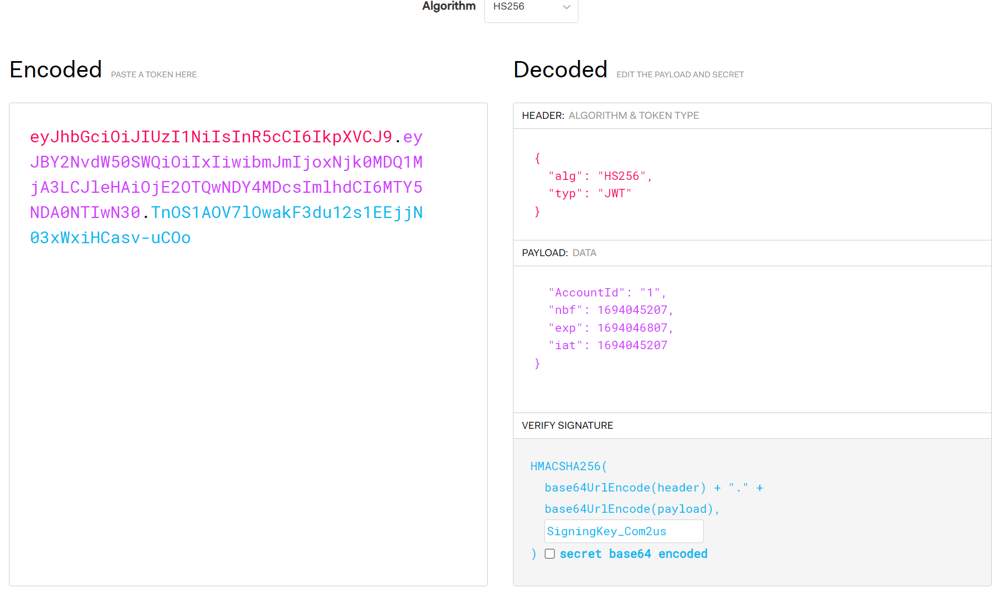

# Blazor_Auth

## 목차

1. [개요](#개요)
2. [커스텀 Layout 생성](#커스텀-layout-생성)
3. [Routing 별 레이아웃 설정](#routing-별-layout-설정)
4. [토큰 인증 구조](#토큰-인증-구조)
5. [Server : 토큰 발급](#server--토큰-발급)
   1. [JwtBearer 설치](#jwtbearer-설치)
   2. [JWT 발급](#jwt-발급)
6. [Server : 토큰 검증](#server--토큰-검증)
   1. [JwtBearer 옵션 설정](#jwtbearer-옵션-설정)
   2. [JWT에서 Claim 추출](#jwt에서-claim-추출)
   3. [이벤트 핸들러](#이벤트-핸들러)
7. [Server : 인증 적용](#server--인증-적용)
   1. [Authorize Attribute](#authorize-attribute)
8. [Client : 토큰 관리](#client--토큰-관리)
   1. [세션 스토리지](#세션-스토리지)
   2. [헤더에 토큰 추가](#헤더에-토큰-추가)
   3. [헤더에서 재발급 토큰 로드](#헤더에서-재발급-토큰-로드)
9. [예시 프로젝트 상세설명](#예시-프로젝트-상세설명)

---

## 개요

이 프로젝트는 [Blazor_Study](https://github.com/sueshinkr/Blazor_Study) 레포지터리의 내용을 기반으로 로그인 및 세션 관리 기능을 추가한 것이다.
<br>변경사항은 다음과 같다.

### 1. 로그인 UI


Base Url에 접근시 최초에는 로그인 화면만 나타난다.<br>
로그인하지 않으면 다른 메뉴들을 볼 수 없고, 주소창에 직접 URL을 입력해도 이동되지 않는다.

### 2. 세션 만료시 접근 불가


이 프로젝트에서는 Session Storage에 JWT 기반 Access Token, Refresh Token을 저장하고,<br>
이것으로 Managing API를 호출한다.

Session Storage에 저장된 토큰이 만료되거나 오염된 경우 토큰이 삭제되고 재로그인을 유도한다.

### 3. 경로 별 Layout 설정

- 기존 메뉴
  

- 변경 후 메뉴
  

경로 별 Layout을 다르게 적용했고, 메뉴 바(네비게이션 바)가 상단에 수평 형태로 위치하도록 변경했다.

<br>

---

## 커스텀 Layout 생성

Blazor는 페이지의 전반적인 구성과 배치 정보를 `Layout` 클래스에 정의한다.<br>

각 페이지의 구체적인 View(시각적인 구성 요소)가 들어갈 영역은 `@Body`로 지정할 수 있다.

|                                 |                                 |
| ------------------------------- | ------------------------------- |
|  |  |

위 화면은 본 프로젝트의 `AfterLoginLayout`이 적용된 `/Lookup_Multiple_Users` 페이지와 `/Lookup_Specific_User` 페이지이다.<br>

Pages 폴더의 `Lookup_Multiple_Users.razor`와 `Lookup_Specific_User.razor`에 정의한 내용은 빨간 박스 영역에만 속하고,<br>
그 외의 구성 요소들(ex. 상단의 메뉴 바)은 **레이아웃**에 속한 것이다.

이처럼 여러 페이지에 **일관된 배치를 적용할 수 있게 해주는 클래스를 `Layout`이라고 한다.**

레이아웃은 `LayoutComponentBase`를 상속받아 생성할 수 있다.<br>
레이아웃 내에서 페이지가 차지하는 영역은 `@Body`로 지정한다.

### 예시 코드

```csharp
// AfterLoginLayout.cs
@inherits LayoutComponentBase

<div>
    <NavMenu /> // 메뉴 바 컴포넌트

    <main>
        <article class="content px-4">
            @Body // 페이지 영역
        </article>
    </main>
</div>
```

이 코드는 본 프로젝트에서 사용된 `AfterLoginLayout`이다.<br>

`/Lookup_Multiple_Users` 페이지에 접속해 개발자 도구의 Elements 탭을 보면,<br>
`Lookup_Multiple_Users.razor`에 작성한 Html 태그들이 `<article>` 요소 내부에 들어가있는 것을 확인할 수 있다.


<br>

---

## Routing 별 Layout 설정

| 메인 화면                       | 로그인 이후 화면                |
| ------------------------------- | ------------------------------- |
|  |  |


이 프로젝트에서는 페이지 경로에 따라 다른 **Layout**을 사용하고 있다.<br>
(사용하는 레이아웃은 각각 **MainLayout**, **AfterLoginLayout** 이다.)

### App.razor 라우팅 설정

Blazor에서 라우팅은 **App.razor** 파일에서 설정 가능하다.<br>

App.razor에서 `NavigationManager`를 주입받으면 현재 경로를 알 수 있다. <br>
이 경로에 따라 `@if-else` 문을 사용해 **`DefaultLayout`에 사용하고자 하는 레이아웃 클래스 타입을 지정**해주면 된다.<br>

본 프로젝트는 초기 페이지(`NavigationManager.BaseUri`)를 제외하고는 모두 AfterLoginLayout을 적용시켰다.

### 예시 코드

```csharp
@inject NavigationManager NavigationManager

<Router AppAssembly="@typeof(App).Assembly">
    <Found Context="routeData">
        // 현재 경로가 MainLayoutPath라면 MainLayout 사용
        @if (NavigationManager.Uri.Equals(MainLayoutPath))
        {
            <RouteView RouteData="@routeData" DefaultLayout="@typeof(MainLayout)" />
        }
        else // 그 외엔 AfterLoginLayout 사용
        {
            <RouteView RouteData="@routeData" DefaultLayout="@typeof(AfterLoginLayout)" />
        }
        <FocusOnNavigate RouteData="@routeData" Selector="h1" />
    </Found>
    <NotFound>
        // 라우팅에 실패한 경우
    </NotFound>
</Router>
```

가령 `BoardLayout.cs`, `MailLayout.cs` 와 같은 커스텀 레이아웃들을 작성했고,<br>
이들을 각각 `/aRoute`, `/bRoute` 경로에 적용하고 싶다면 위의 `@if-else` 부분을 다음과 같이 작성할 수 있다.

```csharp
@if (NavigationManager.Uri.StartsWith("aRoute"))
{
    <RouteView RouteData="@routeData" DefaultLayout="@typeof(BoardLayout)" />
}
else if (NavigationManager.Uri.StartsWith("bRoute"))
{
    <RouteView RouteData="@routeData" DefaultLayout="@typeof(MailLayout)" />
}
```

<br>

---

## 토큰 인증 구조

### JWT(Json Web Token) 기반 Access Token + Refresh Token 방식

JWT 기반의 Access Token과 Refresh Token 두 가지의 토큰을 두고 인증 처리를 하는 구조이다.

- **Access Token**

  Access Token은 클라이언트(프론트엔드)가 요청을 보낼 때 `Authorization` 헤더에 추가해야 하는 토큰이다.<br>
  서버(백엔드)는 `Authorization` 헤더에 있는 Access Token을 검증해 해당 요청을 수행할지 말지 결정한다.<br>
  Refresh Token에 비해 유효기간이 짧다.

- **Refresh Token**

  Access Token을 재발급할 수 있게 해주는 토큰이다.<br>
  최초 로그인 시에 Access Token과 함께 발급된다.

<br>

서버(백엔드)는 **최초 로그인 시 Access Token과 Refresh Token을 클라이언트(프론트엔드)에게 전달**한다.<br>
**이후 API 호출에 대해서는 요청 헤더의 Access Token이 유효한지만 검증**하여 응답을 제공한다.

- 토큰을 사용하는 이유

  세션을 서버(백엔드)에 전부 저장하지 않기 때문에 부하가 적고, Scale-Out 방식의 확장에 유리하다.

- Refresh Token을 사용하는 이유

  서버(백엔드)는 한 번 발급한 토큰을 저장하지 않고, 단지 토큰의 유효성만으로 권한을 부여한다.<br>
  따라서 **토큰이 탈취되면 접근을 막을 수 없다는 위험성**이 있다.<br>
  하지만 Access Token의 유효기간을 너무 짧게 하면 이용이 불편해질 수 있기 때문에<br>
  Access Token의 유효기간은 짧게, Refresh Token은 상대적으로 길게 하여<br>
  Access Token이 만료되어도 Refresh Token이 유효하다면 Access Token을 재발급할 수 있게 하여 이를 보완한다.

<br>

### 최초 로그인

최초 로그인 시의 시퀀스 다이어그램이다.


최초 로그인 성공 시에만 Access Token, Refresh Token을 발급해 응답 Body에 넣어 전송한다.<br>
클라이언트(프론트엔드)는 이 토큰들을 세션 스토리지에 저장해 이후의 API 호출에 사용한다.

<br>

### 토큰 발급 이후 API 호출

토큰 발급 이후, 인증이 필요한 모든 API 호출에 대한 시퀀스 다이어그램이다.


로그인 외의 Managing API 호출 시 토큰을 사용한다.<br>
**(클라이언트는 항상 헤더에 두 토큰을 모두 추가해서 전송한다.)**

Access Token이 만료되어도 Refresh Token이 유효하다면 서버(백엔드)가 새 Access Token을 발급해준다.<br>
Refresh Token도 만료되었다면 다시 로그인부터 시도해야 한다.

<br>

### 서버(백엔드)에서의 AccessToken 재발급 로직

1. Refresh Token을 가져와 기한이 만료되었는지 확인한다.
2. Refresh Token의 Claim에서 `AccountId`를 가져온다.
3. DB에서 `AccountId`로 유저를 찾고, **DB의 `RefreshToken`이 헤더의 Refresh Token과 같은지** 비교한다.
4. 같다면 새 Access Token을 발급해 응답 헤더에 추가하고, API 요청을 이어서 수행한다.

<br>

---

# Server : 토큰 발급

## JwtBearer 설치

### 설치

|                                 |                                 |
| ------------------------------- | ------------------------------- |
|  |  |

Blazor Server, API Server 프로젝트에 Nuget 패키지 관리자 -> 솔루션용 NuGet 패키지 관리에서 `Microsoft.AspNetCore.Authentication.JwtBearer` 를 설치한다.

<br>

---

## JWT 발급

### JWT 구조

JWT은 헤더(Header), 페이로드(Payload), 서명(Signature)의 3가지 파트로 나눠져 있다.<br>


- **헤더** : 어떤 알고리즘을 사용해 암호화 되었는지, 어떤 토큰을 사용하는지에 대한 정보
- **페이로드** : 전달하려는 정보 (단, 노출될 수 있기 때문에 최소한의 정보만 담아야 함)
- **서명** : 검증을 위해 서버가 지정한 Signing Key

여기서, 페이로드에 담는 정보를 클레임(`Claim`)이라고 한다.<br>
클레임에는 **표준 클레임**과 **사용자 정의 클레임**이 있다.

- **표준 클레임**

  1. iss : Issuer. 토큰 발급자의 정보
  2. exp : Expiration Time. 토큰이 만료되는 시간
  3. iat : Issued At. 토큰이 발급된 시간
  4. nbf : Not Before. 토큰 사용을 허용하기 시작하는 시간
  5. aud : Audience. 토큰 대상자(토큰을 발급받는 수신자)

- **사용자 정의 클레임**

  key-value 형태로 사용자 정의 클레임을 추가할 수 있다.<br>
  예시로 본 프로젝트에서는 "`AccountId`"라는 이름의 사용자 정의 클레임을 사용하고 있다.

본 프로젝트에서 발급한 토큰을 실제 디코딩해보면 다음과 같은 결과를 확인할 수 있다.



[참고 사이트 : JSON Web Token 온라인 디코딩 사이트](https://jwt.io/)

<br>

### C#에서의 JWT 발급 방법

C#에서 토큰은 `JwtSecurityTokenHandler`와 `SecurityTokenDescriptor`를 통해 발급할 수 있다.<br>

- `JwtSecurityTokenHandler` : 토큰 생성 및 검증 클래스
- `SecurityTokenDescriptor` : 토큰에 들어갈 정보를 담은 구조체
  - `Subject` 필드 : `Claim`을 추가하는 영역
  - `Expires` 필드 : 토큰 만료기간
  - `SigningCredentials` 필드 : 토큰 검증을 위한 비밀 서명 키 지정

### 예시 코드

```csharp
// JwtSecurityTokenHandler 생성
var tokenHandler = new JwtSecurityTokenHandler();

// Signing Key, 토큰 만료 기간 설정
var key = Encoding.ASCII.GetBytes(_signingKey);
var expires = DateTime.UtcNow.AddHours(6);

// 토큰 구조체 생성
var tokenDescriptor = new SecurityTokenDescriptor
{
    Subject = new ClaimsIdentity(new Claim[]
    {
        new Claim("Key", Value),
        // ... 그 외 클레임 추가
    }),
    Expires = expires,
    SigningCredentials = new SigningCredentials(new SymmetricSecurityKey(key),
                                                SecurityAlgorithms.HmacSha256Signature)
};

// 토큰 생성
var token = tokenHandler.CreateToken(tokenDescriptor);
tokenHandler.WriteToken(token);
```

<br>

---

# Server : 토큰 검증

## JwtBearer 옵션 설정

```csharp
// Program.cs
builder.Services.AddAuthentication(JwtBearerDefaults.AuthenticationScheme)
        .AddJwtBearer(options =>
        {
            options.TokenValidationParameters = new TokenValidationParameters
            {
                ValidateIssuer = false,                                       // Issuer 검증 여부
                ValidateAudience = false,                                     // Audience 검증 여부
                ValidateIssuerSigningKey = true,                              // 비밀 서명 키 검증 여부
                ValidateLifetime = true,                                      // 토큰 유효성 검증 여부
                IssuerSigningKey = new SymmetricSecurityKey
                                       (Encoding.UTF8.GetBytes("SigningKey")) // 비밀 서명 키
            };
        });
```

Program.cs에서, `AddAuthentication`으로 `JwtBearer`를 추가하고 인증(**`Authentication`**)에 필요한 파라미터를 설정한다.<br>

위 코드에서는 `ValidateIssuer`, `ValidateAudience`는 false로 하고 `ValidateIssuerSigningKey`, `ValidateLifetime`은 true로 했다.<br>
따라서 Issuer(토큰 발행자), Audience(토큰 대상자)에 대한 검증은 하지 않되, Signing Key와 만료 기간에 대한 검증은 수행한다.<br>

사용된 옵션에 대한 설명은 아래와 같으며, 더 많은 옵션은 참고 문서에서 확인할 수 있다.

| 옵션                     | 설명                                       |
| ------------------------ | ------------------------------------------ |
| ValidateIssuer           | Issuer(토큰 발행자)에 대한 검증 여부       |
| ValidateAudience         | Audience(토큰 대상자)에 대한 검증 여부     |
| ValidateIssuerSigningKey | Signing Key(비밀 서명 키)에 대한 검증 여부 |
| ValidateLifetime         | 만료 기간에 대한 검증 여부                 |
| IssuerSigningKey         | 비밀 서명키 문자열                         |

[참고 문서 : MSDN TokenValidationParameters](https://learn.microsoft.com/en-us/dotnet/api/microsoft.identitymodel.tokens.tokenvalidationparameters?view=msal-web-dotnet-latest)

<br>

---

## JWT에서 Claim 추출

`JwtSecurityTokenHandler`를 사용해 토큰에서 Claim을 추출한다.<br>
토큰의 Claim은 노출될 위험이 있으므로 이에 주의하여 최소한의 정보를 담아야 한다.

```csharp
var handler = new JwtSecurityTokenHandler();
var readToken = handler.ReadJwtToken(token);

// Claim 추출
var claim = refreshToken.Claims.FirstOrDefault(claim => claim.Type.Equals("Key"));
return claim.Value;
```

### 예시 코드

토큰 페이로드에 `AccountId`라는 Key를 갖는 Claim을 추가했다면, 다음과 같이 사용할 수 있다.

`var accountIdClaim = refreshToken.Claims.FirstOrDefault(claim => claim.Type.Equals("AccountId"));`

<br>

---

## 이벤트 핸들러

### JwtBearerEvents

JwtBearer의 인증 성공/실패 이벤트에 따른 동작을 `options.Events`에서 정의할 수 있다.<br>
람다식 형태로 사용한다.

```csharp
// Program.cs
builder.Services.AddAuthentication(JwtBearerDefaults.AuthenticationScheme)
        .AddJwtBearer(options =>
        {
            // JwtBearer를 사용한 Authentication 이벤트에 대한 핸들러 정의
            options.Events = new JwtBearerEvents
            {
                OnTokenValidated = context => {
                    // 검증 성공 시의 동작
                },

                OnAuthenticationFailed = context =>
                {
                    // 검증 실패 시의 동작
                }
            };
        });
```

[참고 문서 : MSDN JwtBearerEvents](https://learn.microsoft.com/en-us/dotnet/api/microsoft.aspnetcore.authentication.jwtbearer.jwtbearerevents?view=aspnetcore-7.0)

<br>

---

# Server : 인증 적용

```csharp
// Program.cs
app.UseAuthentication(); // 인증 처리
app.UseAuthorization();  // 인가 처리
```

Program.cs에서 `UseAuthentication()`, `UseAuthorization()` 호출 후<br>
인증이 필요한 **엔드포인트에 `Authorize` 어트리뷰트를 추가**하면, 앞서 설정한 토큰에 대한 인증 및 인가 처리가 수행된다.

HTTP 요청에 대한 인증 및 인가 파이프라인은 아래 이미지와 같다.


ASP.NET CORE의 미들웨어는 `HttpContext`를 공유하면서<br>
일반적으로 `UseRouting()` -> `UseCors()` -> `UseAuthentication()` -> `UseAuthorization()` ... 순으로 수행된다.<br>
(단, 이는 일반적인 순서로, 프로젝트에 따라 순서는 변경될 수 있음)<br>

각 미들웨어는 요청에 관련된 정보를 `HttpContext`에 저장하고 수정하며 엔드포인트(각 컨트롤러의 액션)에 도달한다.<br>
인증 및 인가(액세스 권한 부여) 미들웨어도 `HttpContext`를 공유한다.

- **인증 미들웨어 (`Authentication`)**

  `Authentication`은 인증 미들웨어로, HTTP 요청의 인증 데이터(ex. JWT 토큰)를 통해 인증된 사용자인지 확인한다.<br>
  그리고 인증 데이터 속 정보(Claim)들을 추출해 내부적으로 인증 티켓 `AuthenticationTicket`을 생성한다.<br>
  이 `AuthenticationTicket`의 `ClaimsPrincipal`을 `HttpContext.User`에 추가한 후 `Authorization`으로 전달한다.

- **인가 미들웨어 (`Authorization`)**

  `Authorization`은 인가 미들웨어로, `Authentication`이 `HttpContext.User`에 추가한 `ClaimsPrincipal`을 기반으로<br>
  엔드포인트에 대한 인가 처리를 수행한다.

<br>

### 인증 미들웨어 동작 : UseAuthentication

인증 미들웨어는 등록된 인증 스키마에 따라 **사용자의 인증 데이터를 식별**하고 Claim을 추출한 다음,<br>
내부적으로 `AuthenticationTicket`을 생성한다.<br>
그리고 Ticket 정보를 인가 미들웨어(`Authorization`)에서 사용할 수 있도록 **`HttpContext`를 통해 전달**한다.

- **인증 스키마**

  인증 처리를 수행할 체계의 종류를 의미한다.<br>
  인증 미들웨어에 인증 스키마를 등록하면 스키마에 따라 인증 처리를 수행한다.<br>
  본 프로젝트에서는 `JwtBearer`를 추가했으나, `Cookie` 등의 다른 스키마를 추가할 수도 있다.

- **JwtBearer 스키마**

  본 프로젝트는 `AddJwtBearer`를 호출해 JwtBearer 인증 스키마를 등록했다.<br>
  이 스키마는 요청의 `Authorization` 헤더에 있는 JWT 토큰을 확인한다.<br>
  이후 JWT의 페이로드에 있는 정보(Claim)를 추출해 `ClaimsPrincipal`을 구성한 다음 인가 미들웨어(`Authorization`)로 전달한다.

[참고 문서 : MSDN Authentication Concept](https://learn.microsoft.com/ko-kr/aspnet/core/security/authentication/?view=aspnetcore-5.0#authentication-scheme-2)

<br>

### 인가 미들웨어 동작 : UseAuthorization

인가 미들웨어는 인증 미들웨어로부터 제공받은 인증 데이터 `ClaimsPrincipal`을 기반으로<br>
**엔드포인트에 대한 접근 권한**을 결정한다.

`[Authorize]` 어트리뷰트를 사용하기 위해서는 호출해야 한다.<br>
단, 인가 미들웨어를 사용하더라도, `[Authorize]`가 없는 엔드포인트에는 인증되지 않은 사용자도 접근할 수 있다.

<br>

### 인가 조건 부여 : Authorize Attribute

`[Authorize]`는 **조건을 충족하는 인증된 사용자에게만** 엔드포인트에 액세스할 수 있도록 **인가 조건을 부여하는 어트리뷰트**이다.<br>
이 어트리뷰트는 **컨트롤러**나 **액션 메소드**에 추가될 수 있다.<br>

해당 엔드포인트에 **요청이 전달되기 전에** 인가 조건을 확인한다.<br>

인증 미들웨어에서 인증에 실패한 사용자는 `[Authorize]` 어트리뷰트가 있는 엔드포인트에 액세스할 수 없다.<br>
인증에 성공했어도 `[Authorize]` 어트리뷰트에 세부적인 인가 조건(하단 내용)이 있다면 이를 충족해야 한다.<br>

이 어트리뷰트에는 `AuthenticationSchemes`, `Policy`, `Roles` 등의 조건을 설정할 수 있다.

- `AuthenticationSchemes`

  어느 인증 스키마로 권한을 부여할 것인지 지정할 수 있다.<br>
  [참고 문서 : MSDN Authorize with a specific scheme](https://learn.microsoft.com/en-us/aspnet/core/security/authorization/limitingidentitybyscheme?view=aspnetcore-7.0)

- `Policy`

  `AddAuthorization`에서 `AddPoliy`로 추가한 인가 정책을 지정한다.<br>
  [참고 문서 : MSDN 정책 기반 권한 부여](https://learn.microsoft.com/ko-kr/aspnet/core/security/authorization/policies?view=aspnetcore-7.0)

- `Roles`

  Claims의 Role Type에 따라 인가를 처리한다.<br>
  [참고 문서 : MSDN 역할 기반 권한 부여](https://learn.microsoft.com/ko-kr/aspnet/core/security/authorization/roles?view=aspnetcore-7.0)

아래는 `AccountId`라는 `Claim`을 포함해야 한다는 인가 정책(Policy)을 추가한 예시 코드이다.

```csharp
// Program.cs
builder.Services.AddAuthorization(options =>
{
    options.AddPolicy("AccountIdPolicy", policy => policy.RequireClaim("AccountId"))
});
```

```csharp
// UserDataController.cs
// UserData 컨트롤러에 AccountIdPolicy 정책 적용
[Authorize(Policy = "AccountIdPolicy")]
[ApiController]
[Route("api/[controller]")]
public class UserData {...}
```

<br>

---

# Client : 토큰 관리

## 세션 스토리지

세션 스토리지는 **브라우저의 탭 단위에서 데이터를 저장할 수 있는 공간**이다.<br>
브라우저를 닫거나 해당 탭을 닫으면 저장 데이터가 사라진다.

`JSRuntime` 서비스를 통해 세션 스토리지에 토큰을 저장, 수정, 삭제할 수 있다.<br>
세션 스토리지에는 key-value 형태로 값을 저장할 수 있으며, 사용 방식은 아래와 같다.

```csharp
await _jsRuntime.InvokeVoidAsync("sessionStorage.setItem", "Key값", Value); // 데이터 저장
await _jsRuntime.InvokeAsync<string>("sessionStorage.getItem", "Key값");    // 데이터 로드
```

<br>

---

## 헤더에 토큰 추가

Blazor 클라이언트에서 서버로 요청을 보낼 때, Access Token과 Refresh Token<br>
두 가지 모두를 헤더에 추가해야 한다.

**이때, 액세스 토큰은 `Authorization` 헤더에 추가해야 한다.**<br>
서버(백엔드)에 등록된 JwtBearer 스키마는 `Authorization` 헤더에서 액세스 토큰을 찾아 인증하기 때문이다.

헤더에 토큰을 저장하는 방법은 아래와 같다.<br>

```csharp
var requestMessage = new HttpRequestMessage(HttpMethod.Post, ApiPath);  // Request 메시지

// 인증 토큰은 Authorization 헤더에 추가
requestMessage.Headers.Authorization = new AuthenticationHeaderValue("Bearer", token);

requestMessage.Headers.Add("헤더명", "Value");                          // Header에 데이터 추가
requestMessage.Headers.Remove("헤더명");                                // Header에서 데이터 삭제
```

<br>

---

## 헤더에서 재발급 토큰 로드

Access Token이 만료되었지만 Refresh Token이 유효하여 Access Token을 재발급받은 경우,<br>
본 프로젝트의 서버는 `X-NEW-ACCESS-TOKEN` 헤더에 재발급한 토큰을 추가해 전송한다.

헤더에서 값을 가져오는 방법은 아래와 같다.

```csharp
// out 파라미터 newAccessToken으로 값을 로드
res.Headers.TryGetValues("X-NEW-ACCESS-TOKEN", out var newAccessToken);
```

실제 값은 out 파라미터로 로드한 변수의 Value 필드에 저장되어있다.<br>
따라서 다음과 같이 사용 가능하다.

```csharp
Console.WriteLine(newAccessToken.Value);
```

<br>

---

# 예시 프로젝트 상세설명

## 페이지 공통

API 통신이 필요할 때 해당하는 `Service`의 함수를 호출한다.<br>
각 서비스는 Blazor Server로 API를 호출하고, Blazor Server는 상황에 따라 **인증 처리를 한 후 응답**을 보낸다.

Blazor Server에서 제공하는 데이터는 실제 DB와 연동되지 않은 더미 데이터이다.

**API를 호출하거나, 페이지에 진입할 때마다 토큰이 유효한지 인증**한다.<br>
인증에 실패하면 세션 스토리지의 토큰이 무효화되고, 로그인 화면으로 강제 이동한다.

본 프로젝트는 DB와 연동되어있지 않다.<br>
로그인 가능한 계정은 이메일 `genie@com2us.com`, 비밀번호 `1234` 이다.

UserData에 대한 Edit UI가 존재하지만, DB가 없기 때문에 별도의 데이터 갱신은 이루어지지 않는다.

<br>

---

## 최상위 페이지 : AuthPage.razor

본 프로젝트는 로그인 이후의 모든 페이지에 진입할 때마다 토큰 인증을 진행하고 있다.<br>
따라서 모든 페이지가 상속하는 최상위 페이지에 인증 로직을 구현했다.

별도의 View(화면 구성 요소)는 존재하지 않고, 토큰 인증을 위한 `@code` 로직만 존재한다.

```csharp
@inject IConfirmService ConfirmService
@inject NavigationManager NavigationManager
@inject Blazored.SessionStorage.ISessionStorageService sessionStorage

@inject AuthService AuthService
@inject IJSRuntime jsRuntime


@code {
    // 페이지가 렌더링되기 전에 수행
    protected override async Task OnInitializedAsync()
    {
        var (verified, resetToken) = await CheckSession();

        if (verified == false)
        {
            await MoveToLogin(resetToken);
        }
    }

    // 세션 스토리지의 토큰을 무효화하고 로그인 페이지로 강제 이동
    protected async Task MoveToLogin(bool resetToken = false)
    {
        if (resetToken)
        {
            await sessionStorage.SetItemAsync<string>("accesstoken", "");
            await sessionStorage.SetItemAsync<string>("refreshtoken", "");
        }
        NavigationManager.NavigateTo("/", true);
    }

    // 세션 토큰이 유효한지 확인
    async Task<(bool, bool)> CheckSession()
    {
        var accessToken = await sessionStorage.GetItemAsync<string>("accesstoken");
        if (accessToken == null || accessToken.Equals(""))
        {
            return (false, false);
        }

        var verified = await AuthService.CheckToken();
        return (verified == ErrorCode.None, true);
    }
}
```

인증이 필요한 모든 페이지(로그인 화면을 제외한 모든 페이지)는 AuthPage를 상속받아 다음과 같이 사용한다.

```csharp
@inherits AuthPage

// ...

@code {
    protected override async Task OnInitializedAsync()
    {
        await base.OnInitializedAsync();
        // 이후 동작 정의
    }
}
```

상속받은 페이지에서 `OnInitializedAsync` 단계에 수행해야할 작업이 있다면<br>
`base`의 `OnInitializedAsync`를 먼저 호출한 후 수행해야 한다.

<br>

---

## 로그인 페이지 : Login.razor


### 사용된 주요 컴포넌트

- **GridRow** (Ant Design)
  ```html
  <GridRow Justify="center">
    <GridCol Span="5">
      <!-- ...그리드 안에 들어갈 View... -->
    </GridCol>
  </GridRow>
  ```

`AntDesign` 라이브러리의 Grid 시스템을 사용해 화면을 구성했다.<br>

`AntDesign`의 Grid는 24등분을 기반으로 한다.<br>
`Span`에 지정한 값이 24등분한 Grid 내에서의 크기가 된다.<br>

위 예시 코드에서 `GridCol` 요소는 24등분 그리드를 가로로 5칸 차지하는 크기를 갖게 된다.<br>
가로로 한 줄을 전부 차지하게 하려면 Span값을 24로 지정하면 된다.

`Justify`는 해당 구성 요소의 정렬을 지정한다. `center`로 하면 상위 요소의 가운데 위치에 정렬된다.

- **Card** (Ant Design)

  ```csharp
  <Card Title="Login" Style="width:100;">
    <Body>
      <!-- ...카드 바디 안에 들어갈 View... -->
    </Body>
  </Card>
  ```

`AntDesign` 라이브러리의 Card 컴포넌트를 사용해 로그인 창을 구성했다.<br>
Card는 `Title`과 `<Body>`로 이루어진 직사각형 구성 요소이다.

Title에 문자열을 지정해 상단의 제목을 설정할 수 있다.


- **Input** (Ant Design)

  ```html
  <AntDesign.Input Placeholder="Email" @bind-Value="@email">
    <Prefix>
      <Icon Type="user" />
    </Prefix>
  </AntDesign.Input>

  @code { public string email { get; set; } = string.Empty; }
  ```

`AntDesign` 라이브러리의 Input 컴포넌트를 사용해 이메일, 비밀번호 입력 칸을 구성했다.<br>
Input 태그 내부에 `<Prefix>`와 `<Icon>`을 사용해 칸 왼쪽에 아이콘을 설정할 수 있다.<br>

설정할 수 있는 아이콘은 라이브러리 문서에서 확인 가능하다.

[참고 문서 : AntDesign Icon](https://ant.design/components/icon)

`Placeholder`에 지정한 문구는 Input이 비어있을 때에 나타난다.<br>
Input과 바인딩될 변수는 `@bind-Value`에 지정할 수 있다.


- **Button** (Ant Design)

  ```csharp
  <Button Type="@AntDesign.ButtonType.Primary" @onclick="OnClickLogin" Loading="loading">
  				Login
  </Button>

  @code {
    public bool loading { get; set; } = false;

    async Task OnClickLogin()
    {
        // 빈 칸이 있을 때
        if (email.Equals("") || password.Equals(""))
        {
            await ConfirmService.Show("이메일과 비밀번호를 입력해주세요.", "Error", ConfirmButtons.OK);
            return;
        }

        // Auth Service에 로그인 요청
        loading = true;
        var loginResult = await AuthService.Login(email, password);
        loading = false;

        // 로그인 실패
        if (loginResult == null || loginResult.Result != ErrorCode.None)
        {
            await ConfirmService.Show("로그인에 실패했습니다. 이메일과 비밀번호를 다시 확인해주세요.",
                                      "Error", ConfirmButtons.OK);
            return;
        }

        // 로그인 성공
        await sessionStorage.SetItemAsStringAsync("accesstoken", loginResult.accessToken);
        await sessionStorage.SetItemAsStringAsync("refreshtoken", loginResult.refreshToken);

        NavigationManager.NavigateTo("/Lookup_Specific_User");
    }
  }
  ```

`AntDesign` 라이브러리의 Button 컴포넌트를 사용해 로그인 요청 버튼을 구성했다.<br>

**버튼 색상**은 `Type`으로 지정 가능하다.<br>
버튼에 **로딩 효과**를 주고싶다면 `Loading`에 bool타입 변수를 지정해 구현할 수 있다.

버튼 클릭 시에 바인드할 함수는 `@onclick`에 지정 가능하다.<br>


- **ConfirmService** (Ant Design)

  ```csharp
  @inject IConfirmService ConfirmService

  @code {
    await ConfirmService.Show("로그인에 실패했습니다.", "Error", ConfirmButtons.OK);
  }
  ```

`AntDesign` 라이브러리의 `ConfirmService`를 주입받아 모달 창을 띄울 수 있다.<br>

<br>

---

## 로그인 페이지 레이아웃 : MainLayout.razor


```csharp
@inherits LayoutComponentBase

<div style="background-color:#001529; height:100vh;">
    <main>
        <article class="content px-4">
            @Body
        </article>
    </main>
</div>

<RadzenDialog />
<RadzenNotification/>
<RadzenContextMenu/>
<RadzenTooltip/>
```

배경색을 남색으로 지정하고, div의 높이 `height`를 `100vh`로 지정했다.<br>
화면 전체가 남색으로 가득차게 하기 위함이다.

---

## 로그인 이후 페이지 레이아웃 : AfterLoginLayout.razor


```csharp
@inherits LayoutComponentBase

<div>
    <NavMenu />

    <main>
        <article class="content px-4">
            @Body
        </article>
    </main>
</div>

<RadzenDialog />
<RadzenNotification />
<RadzenContextMenu />
<RadzenTooltip />
```

`NavMenu` 컴포넌트를 상단에 가지고 있고, 하단에는 각 View가 배치되는 구성이다.

---

## 네비게이션 바 레이아웃 : NavMenu.razor

```csharp
@inject NavigationManager NavigationManager
@inject Blazored.SessionStorage.ISessionStorageService sessionStorage

<Header Class="header" Style="width:100%">
    <div style="display:inline-block; margin-right:1.5vw;">
        <h4 style="color:white"><Icon Type="setting" Theme="outline" /> ManagingTool</h4>
    </div>
    <Menu Theme="MenuTheme.Dark" Mode="MenuMode.Horizontal" Style="display:inline-block">
        <MenuItem Key="1" RouterLink="/Lookup_Specific_User">
            <Icon Type="user" Theme="outline" />
            Lookup Specific User
        </MenuItem>
        <MenuItem Key="2" RouterLink="/Lookup_Multiple_Users">
            <Icon Type="user" Theme="outline" />
            Lookup Multiple Users
        </MenuItem>
        <MenuItem Key="3" @onclick="Logout">
            <Icon Type="logout" Theme="outline" />
            Logout
        </MenuItem>
    </Menu>
</Header>

@code {

    async Task Logout()
    {
        await sessionStorage.RemoveItemAsync("accesstoken");
        await sessionStorage.RemoveItemAsync("refreshtoken");
        NavigationManager.NavigateTo("/");
    }
}
```

상단에 수평 네비게이션 바 형태로 배치시키기 위해 `AntDesign`에서 제공하는 템플릿을 사용했다.<br>

### 사용한 주요 컴포넌트


- **Menu** (Ant Design)

```csharp
<Menu Theme="MenuTheme.Dark" Mode="MenuMode.Horizontal" Style="display:inline-block">
    <MenuItem>
        <!-- ...MenuItem 내부 구성 요소... -->
    </MenuItem>
</Menu>
```

`Theme`에 테마 타입을 지정할 수 있다.<br>
`Mode`에 Horizontal, Vertical 등 메뉴 배치 모드를 지정할 수 있다.<br>

내부에 `MenuItem` 컴포넌트를 복수개 가질 수 있는 구조이다.


- **MenuItem** (Ant Design)

```csharp
<MenuItem Key="1" RouterLink="/Lookup_Specific_User">
    <Icon Type="user" Theme="outline" />
    Lookup Specific User
</MenuItem>
```

`RouterLink`에 해당 메뉴를 누르면 어느 페이지로 이동시킬지 경로를 지정한다.<br>
`Key`값으로 메뉴마다 식별 가능한 값을 지정할 수 있다.<br>

`MenuItem` 내부에 아이콘과 메뉴 이름을 설정할 수 있다.

```csharp
<MenuItem Key="3" @onclick="Logout">
    <Icon Type="logout" Theme="outline" />
    Logout
</MenuItem>

@code {
    async Task Logout()
    {
        await sessionStorage.RemoveItemAsync("accesstoken");
        await sessionStorage.RemoveItemAsync("refreshtoken");
        NavigationManager.NavigateTo("/");
    }
}
```

`RouterLink`를 지정하지 않거나, `@onclick`으로 클릭 시의 함수를 바인드할 수 있다.<br>
본 프로젝트에서는 Logout 메뉴에 대해 별도의 경로를 지정하지 않고, 함수 수행 후 로그인 화면으로 돌아가도록 처리했다.

<br>

---

## 서비스 공통 : BaseService.cs

클라이언트에서 서버로 요청을 보낼 때, 세션 스토리지에 있는 두 가지 토큰을 모두 헤더에 추가해서 전송해야 한다.

이에 대한 공통 함수들을 BaseService에 구현했으며, 모든 서비스는 BaseService를 상속받아<br>
하단의 기능을 공유한다.

- `CreateReqMsg`

  Http 메소드 타입, API 경로, 직렬화할 JSON Body, 헤더 추가 여부를 매개변수로 받아 RequestMessage를 생성한다.

- `SerializeReqBody`

  Object를 Json 직렬화한 다음 요청 바디에 저장한다.

- `AttachTokensToRequestHeader`

  요청 헤더에 토큰을 추가한다.

<br>

---

## AuthService.cs

ManagingTool 로그인과 토큰 유효성 검사 요청을 담당한다.

- `CheckToken`

  헤더에 토큰을 추가해 GET 메소드로 검사 요청을 보낸다. 실패 시 `ErrorCode.Unauthorized`를 반환한다.

- `Login`

  이메일과 패스워드를 전송받아 POST 메소드로 로그인을 시도한다. 헤더에 토큰을 추가하지 않는다.

---

## UserService.cs

로그인 이후 운영 API를 호출할 때 사용되는 서비스이다.<br>
유저 데이터에 대한 API 호출을 담당한다. 제공되는 데이터는 모두 더미 데이터이다.

모든 요청의 헤더에 토큰을 추가한다.

- `GetUserBasicInfo`

  UserID를 받아, 해당하는 유저의 기본 정보를 불러온다.

- `GetMultipleUserBasicInfo`

  Category와 Max, Min Value를 받아 범위에 해당하는 유저들의 정보를 불러온다.

- `GetUserItemList`

  UserID를 받아 해당하는 유저의 아이템 목록을 가져온다.

- `GetUserMailList`

  UserID를 받아 해당하는 유저의 메일 목록을 가져온다.

---

## 서버 인증 옵션 및 핸들러 정의 : JwtBearerConfig.cs

ManagingTool.Server에서 인증에 사용되는 `TokenValidationParameters` 및<br>
인증 이벤트 핸들러를 정의한 파일이다.

- `tokenValidatedParameters`

  AddJwtBearer 시에 사용되는 인증 옵션 파라미터이다.

- `OnAuthenticationFailedHandler`

  `Authorization` 헤더에 담긴 Access Token 인증이 실패했을 경우에 수행되는 핸들러이다.<br>
  Refresh Token이 유효하다면 새 Access Token을 재발급하고, 요청을 정상 처리한다.

<br>

---

## 서버 토큰 관리 클래스 : TokenManager.cs

ManagingTool.Server의 `TokenManager`는 토큰을 생성하고, 토큰에 담긴 Claim을 추출할 수 있다.

- `CreateTokens`

  Access Token과 Refresh Token을 생성해 리턴한다.

- `CreateToken`

  토큰 종류에 따라 만료 기간을 다르게 하여 토큰을 생성한다.

- `GetClaim`

  토큰의 페이로드에 담긴 Claim을 추출해낸다.

<br>

---
